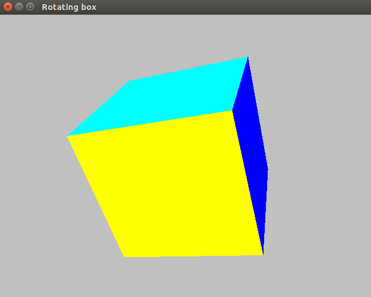

# Rotating-Cube
Rotating Cube using Qt5.2.0/OpenGL/Quaternion/Shaders

project was made in Qt 5.2.0 on Ubuntu 16.4  2018.06.25

Prerequisites

after Qt installation were used these commands:
sudo apt-get install build-essential // Install g++

sudo apt-get install libfontconfig1  // install fonts

sudo apt-get install mesa-common-dev // install OpenGL libraries

sudo apt-get install libglu1-mesa-dev -y // sometime you need it

